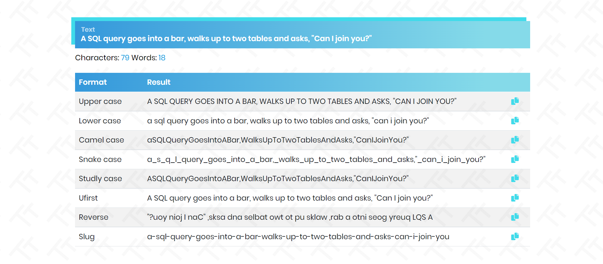

# Simple Text Tool

Text converter built with Laravel Livewire.

## Installation

1. Download or clone the project 
1. Run `composer install`
1. Rename or copy `.env.example` file to `.env`
1. Run `php artisan serve` 
1. Visit `localhost:8000` in your browser

## Preview

## License

The MIT License (MIT). Please see [License File](LICENSE.md) for more information.

## Support

